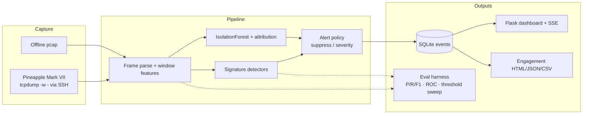

# Architecture

Passive Wi-Fi intrusion detection: Pineapple (or pcap) → features → signatures + ML → alerts → dashboard / reports.

## Layers

| Layer | Role |
|---|---|
| **Capture** | Receive-only RF over SSH `tcpdump`, or local pcap |
| **Features** | Per-BSSID windows: deauth/EAPOL counts, SSID diversity, encryption flags |
| **Signatures** | Rule detectors with tunable thresholds (deauth FPR measured in eval) |
| **ML** | IsolationForest (runtime) vs One-Class SVM (eval compare); z-deviation “why” text |
| **Policy** | Dedup, BSSID/type suppressions, severity scores |
| **Product** | Dashboard badge from last `make eval`, engagement reports, audit JSONL |

## Safety boundary

Live RF **actions** (lab deauth) require: target ∈ lab allowlist ∩ WIDS allowlist + human `CONFIRM` + audit log. Default path is **passive monitor only**.
